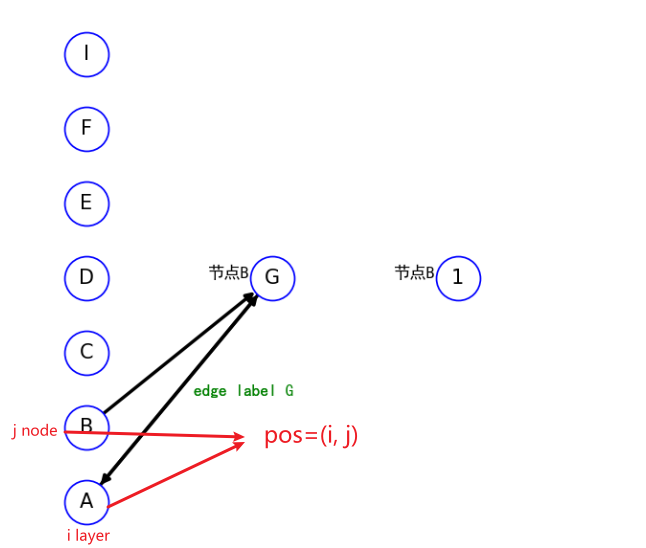
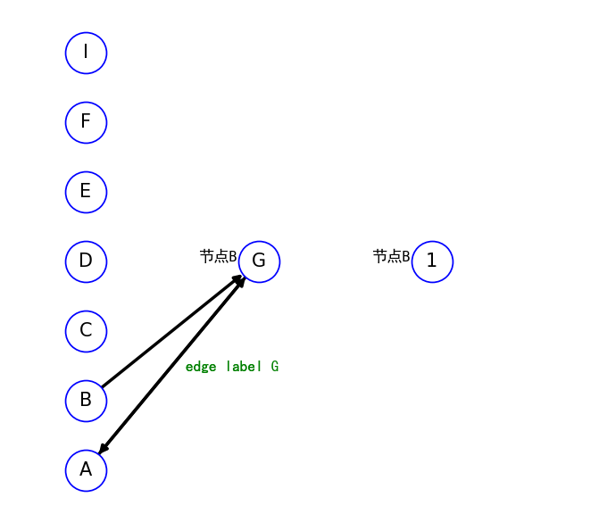

# networkXsimple

This is a simple encapsulation for networkX, which further simplifies the process of networkX for drawing neural network diagrams, so that the author can only focus on the logical writing of neural networks, without spending time on the visual presentation of neural networks. At the same time, this module also inherits all the methods of network and does not affect the normal function calls of networkX.

# install
`
pip install NetworkXsimple
`
# guid

### api
```python
graph.addNode(
    name="node name",
    pos=(int layer, int node No)  ,
    nexts=[
    {
        "node": "G",
        "label":"edge label"
    }],
    previous=[
        {
            "node": "G",
            "label": "edge label G"
        }
    ],
    label="AAAAA",
    label_color="pink")
```

* nexts : output degress   dict
* previous : input degress  dict
``
 {
        "node": "next node name",
        "label":"edge desc"
    }
``

# exmaple

```python

from package_xskj_NetworkXsimple import netGraph

from net import netGraph


# 示例用法
graph = netGraph(type=1)

# 添加节点
graph.addNode(
    name="A",
    pos=(1, 1) ,
    nexts=[
    {
        "node": "G",
        "label":"edge label"
    }],
    previous=[
        {
            "node": "G",
            "label": "edge label G"
        }
    ],
    label="AAAAA",
    label_color="pink")


graph.addNode(name="B", label="BBBBB",  pos=(1, 2))
graph.addNode(name="C", label="BBBBB",  pos=(1, 3))
graph.addNode(name="D", label="节点A", pos=(1, 4))
graph.addNode(name="E", label="节点A", pos=(1, 5))
graph.addNode(name="F", label="节点A", pos=(1, 6))
graph.addNode(name="I", label="节点A", pos=(1, 7))
graph.addNode(name="G", label="节点B", pos=(2, 1))
# graph.addNode(name="H", desc="节点B", pos=(2, 2))
# graph.addNode(name="Z", desc="节点B", pos=(2, 3))

graph.addNode(name="1", label="节点B", pos=(3, 1))
# graph.addNode(name="2", desc="节点B", pos=(3, 2))
# graph.addNode(name="3", desc="节点B", pos=(3, 3))

# 增加边
graph.addEdge(("B", "G"))
# 绘制网络图
graph.draw()
```
### show


## update log
