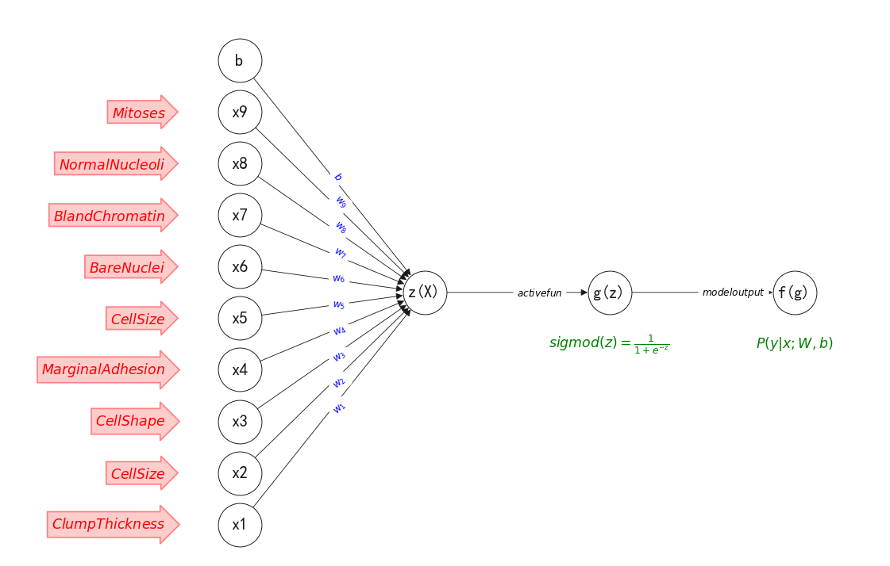

# networkXsimple

This is a simple encapsulation for networkX, which further simplifies the process of networkX for drawing neural network diagrams, so that the author can only focus on the logical writing of neural networks, without spending time on the visual presentation of neural networks. At the same time, this module also inherits all the methods of network and does not affect the normal function calls of networkX.

* 简化版的networkX绘制简单且容易上手的神经网络绘图库,
* 基于networkX开发
# install
`
pip install NetworkXsimple
`
# guid

### guide
```python

from package_xskj_NetworkXsimple import netGraph
import numpy as np
import matplotlib.pyplot as plt


# 设置正常显示符号
plt.rcParams["axes.unicode_minus"] = False
sns.set_theme()
plt.rcParams['font.sans-serif']=['SimHei']   # 用黑体显示中文


# 实例化netGraph对象
networkGraph =netGraph(type=1)

# 增加网络节点
networkGraph.addNode(
    name="节点名称标识",
    pos=(所在网络层layer, 该网络层中1开始从下往上的节点索引),
    label= "该节点node的描述label",
    label_color="label的颜色，默认black",
    # 出度edge边信息
    nexts=[
        {
            "node": "连接node的name",
            "label": "edge边标签",
            "color": "edge边标签颜色",
            "weight": edge边的权重
        },
    ],
    previous=[
         {
            "node": "连接node的name",
            "label": "edge边标签",
            "color": "edge边标签颜色",
            "weight": edge边的权重
        },
    ]
)

# 增加edge边
edge = {
    "node":  name,        # 入度连接节点的node     str     对应于节点在网络中唯一标识符 name
    "label":  label,      # 入度edge的标签        str     作为edge信息展示   默认为None
    "color":  color,      # 标签label和edge的颜色  str     默认为 black
    "weight": weight      # 入度edge的权重        float    默认为1
  }

# 绘制网络图
networkGraph.draw()

# 获取nx.Graph()实例，用于直接访问networkX定义的属性和方法，便于用户更多的操作网络图的自主性
G = networkGraph.getNetworkXInstance()
......
```

* nexts : output degress   dict
* previous : input degress  dict
``
 {
        "node": "next node name",
        "label":"edge desc"
    }
``

# exmaple

```python

from package_xskj_NetworkXsimple import netGraph

from net import netGraph

# 示例用法
graph = netGraph(type=1)

# 添加节点
graph.addNode(
    name="A",
    pos=(1, 1),
    nexts=[
        {
            "node": "G",
            "label": "edge label"
        }],
    previous=[
        {
            "node": "G",
            "label": "edge label G"
        }
    ],
    label="AAAAA",
    label_color="pink")

graph.addNode(name="B", label="BBBBB", pos=(1, 2))
graph.addNode(name="C", label="BBBBB", pos=(1, 3))
graph.addNode(name="D", label="节点A", pos=(1, 4))
graph.addNode(name="E", label="节点A", pos=(1, 5))
graph.addNode(name="F", label="节点A", pos=(1, 6))
graph.addNode(name="I", label="节点A", pos=(1, 7))
graph.addNode(name="G", label="节点B", pos=(2, 1))
# graph.addNode(name="H", desc="节点B", pos=(2, 2))
# graph.addNode(name="Z", desc="节点B", pos=(2, 3))

graph.addNode(name="1", label="节点B", pos=(3, 1))
# graph.addNode(name="2", desc="节点B", pos=(3, 2))
# graph.addNode(name="3", desc="节点B", pos=(3, 3))

# 增加边
graph.addEdge(("B", "G"))
# 绘制网络图
graph.draw()
```
### show


## update log

* 2024.4.12  增加直接操作networkX的方法实例，且完善了api文档使用 , 对应版本v0.2.1
